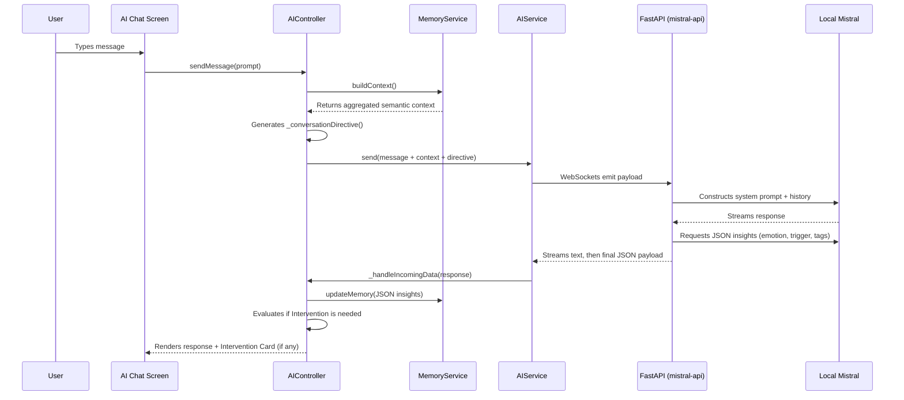

# AI Chat Architecture

The PsyFi AI Chat Architecture uses a sophisticated local pipeline to provide contextual, emotionally aware responses without sounding robotic. It relies on a local FastAPI WebSocket server communicating with a Flutter client.

## Chat Message Lifecycle

## Implementation Details

### 1. The Controller (`lib/aichat/aichat_controller.dart`)
This is the core state manager for the chat experience. 
- It tracks the `history` of the conversation.
- When the user sends a message, it intercepts it to append the hidden `context` and `conversationDirective`.
- **`_conversationDirective()`**: A dynamic set of rules generated per-message. It changes the requested length of the AI's response based on the `CareState` (e.g., if the user is `overwhelmed`, the response is requested to be "short and spacious").

### 2. Context Collection (`lib/core/components/memory_service.dart`)
Instead of sending raw episodic history, `MemoryService.buildContext()` generates a dense text block detailing:
- Core issues and frequent triggers
- The last known emotion and `CareState`
- Coping style preferences
- The most recent Memory Diary summary
This ensures the AI remains deeply contextualized without requiring excessive token limits.

### 3. The Backend (`mistral-api/app/main.py`)
- Runs a FastAPI WebSocket endpoint at `/chat`.
- Maintains a strict `CHAT_SYSTEM_PROMPT` instructing Mistral to act as an empathetic, non-judgmental companion, avoiding markdown and clinical advice.
- When a user message arrives, it first streams the conversational response.
- Behind the scenes, it then queries Mistral *again* (or as part of a tool call/schema enforcement) to extract structured JSON containing:
  - `emotion`
  - `tags` (Array of topics)
  - `insights.trigger`
  - `insights.severity`
  - `insights.core_issue`
  - `needs_grounding` (Boolean)
  - `needs_professional_help` (Boolean)
  - `follow_up_question`

### 4. Post-Processing and UI Update
When the final JSON arrives at `AIController`:
- `MemoryService.updateMemory` is called, saving the extracted emotion and triggers to Hive.
- `_shouldOfferIntervention()` is evaluated. If the user has conversed enough and their emotional state warrants it, an intervention from the `AdaptiveWellnessService` is attached to the `ChatMessage` and displayed directly in the chat UI.
- The UI renders the AI's text and dynamically presents follow-up questions or intervention buttons based on the structured data.

## Important Notes
- **Privacy:** Chat logs are saved locally via `ChatStorage` (`lib/core/components/chat_storage.dart`) using Hive. They are not synced to the cloud.
- **Safety Overrides:** If `needs_professional_help` returns true, or if the `CareState` is `highRisk`, the UI actively alters its layout to prioritize crisis support resources over regular chat flow.
