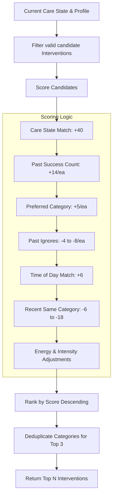

# Behavioral Activation and Intervention System

The Behavioral Activation System is designed to guide users from dysregulated states (anxious, overwhelmed, isolated) back to stability through small, safe, actionable steps. It dynamically selects, scores, and ranks interventions rather than offering static lists.

## Core Components

1. **`BehavioralIntervention` Model (`lib/core/adaptive/intervention.dart`)**
   Defines an intervention with an ID, category, intensity (low/medium/high), estimated duration, required care states, and a gentle prompt string.
2. **`InterventionLibrary` (`lib/core/adaptive/intervention_library.dart`)**
   The static database containing all possible interventions.
3. **`AdaptiveWellnessService` (`lib/core/adaptive/adaptive_wellness_service.dart`)**
   The controller that wraps the `MemoryService` and `InterventionLibrary` to retrieve contextually appropriate suggestions.

## Intervention Library Categories

Interventions are classified into categories such as:
- `bodyRegulation` (Drinking water, posture reset)
- `movementActivation` (Room walk, stretching)
- `socialActivation` (Reply to one message, near people)
- `confidenceActivation` (Tiny achievable wins, desk reset)
- `overthinkingInterruption` (Object observation, cold water reset)
- `grounding` (5-4-3-2-1 technique)
- `breathing` (Slow breathing)
- `journaling` (Gentle reflection)
- `professionalSupport`

## The Selection and Ranking Flow

When the homepage or AI Chat needs to recommend an action, the following flow occurs in `InterventionLibrary.personalized()`:

### Personalization Mechanics
- **Energy Matching:** If a user's profile indicates `"energy_pattern": "low_evening"`, and the current time is evening, high-intensity interventions suffer a massive penalty.
- **Fatigue Prevention:** If a user recently completed a breathing exercise, breathing exercises are penalized so they aren't repeatedly suggested.
- **Dynamic Preferences:** The `MemoryService` updates `support_preferences` based on what the user marks as "helpful" (`effectiveness_score >= 4`), boosting those specific interventions in the future.

## Intervention Tracking

When an intervention is presented:
1. It is shown as a card or prompt.
2. If skipped, `MemoryService.recordInterventionEvent(action: "skipped")` is called.
3. If completed, `MemoryService.recordInterventionEvent(action: "completed")` is called, and the user is prompted for an `effectiveness_score`.
4. These events are saved to the Hive `intervention_history` and `behavioral_activation_history` stores.

## Important Notes
- The "AI" does not invent interventions. It is only given the IDs and titles of the top *already scored and safe* interventions to reference naturally in chat. This prevents the AI from hallucinating dangerous or inappropriate clinical advice.
