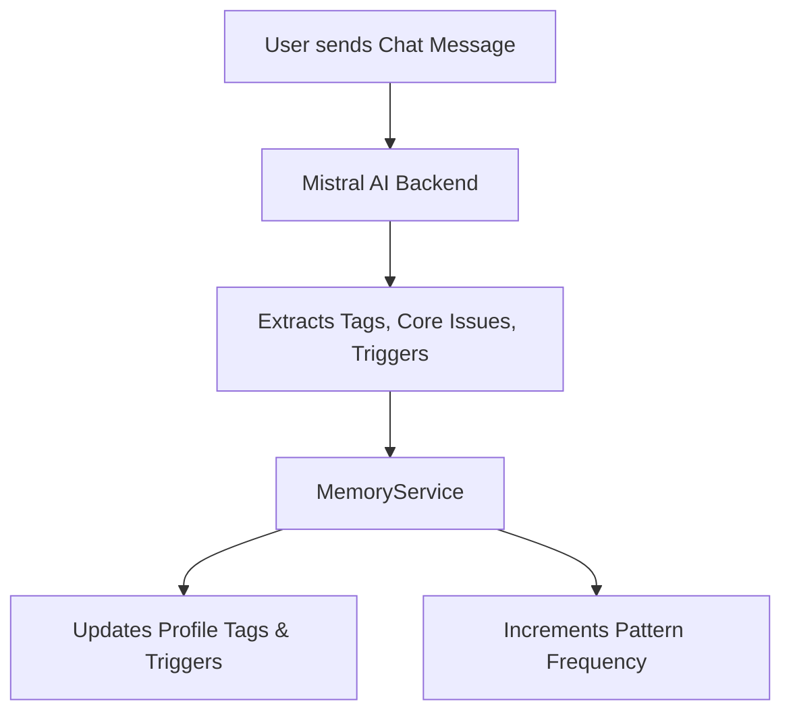

# Context, Memory, and Tag System

PsyFi uses a multi-tiered memory architecture to persist, extract, and reuse context across different sessions and interactions. Rather than relying on vector databases or heavy cloud integrations, the contextual memory is strictly local-first and relies heavily on structured data aggregation.

## Contextual Memory Architecture

The memory system is divided into three primary timeframes:

1. **Transient Context (Current Session):** Raw UI inputs, check-in data, and the active chat conversation state.
2. **Episodic Memory (Rolling Window):** Raw events stored in the Hive `events` list, capturing the last ~180 interactions (journals, check-ins, messages).
3. **Semantic/Long-Term Memory:** Aggregated insights extracted from episodic memories, saved into the `profile`, `patterns`, and `diary` collections.

## Tag and Feature Generation

Tags and core issues are generated primarily during interactions with the AI Backend.

### 1. Extracted Tags and Core Issues
When the `mistral-api` responds, it includes `tags` and `core_issues` in a JSON payload. 
- **Origin:** Mistral AI.
- **Storage:** Hive `profile["tags"]` and `profile["core_issues"]`.
- **Consumers:** `MemoryService.buildContext()` uses them to prime the AI prompt on subsequent interactions.

### 2. Emotional Triggers and Patterns
Whenever an event occurs (check-in, journal, chat), a `trigger` is either extracted by the AI or inferred locally.
- **Update Mechanism:** `MemoryService` increments the integer count for that trigger in the `patterns` map.
- **Storage:** Hive `patterns` (e.g., `{"work stress": 4, "loneliness": 2}`).
- **Consumers:** The `CareStateEngine` looks for triggers with a count >= 3 to flag "recurring triggers", which boosts the `anxious` and `overwhelmed` care states.

### 3. Energy and Support Preferences
PsyFi actively learns what support types work.
- **Origin:** Contextual check-in forms (`neededMost` input) and post-intervention feedback scores.
- **Storage:** Hive `profile["energy_pattern"]` and `support_preferences` object.
- **Consumers:** Used to dynamically sort and filter the `InterventionLibrary` to recommend actions matching the user's current energy state (e.g., suggesting reflection instead of action if energy is low).

## Building the AI Context Window

When initializing a new AI chat, PsyFi does not send the entire raw history. Instead, `MemoryService.buildContext()` aggregates the long-term semantic memory into a dense system prompt.

The constructed context includes:
- Top 3 Core Issues
- Top 3 Frequent Triggers
- Last known emotion
- Current `CareState`
- Coping/Support preferences
- The most recent Memory Diary summary
- Currently curated personalized interventions

This design ensures the AI acts contextually aware without exceeding context limits or needing a vector search backend.

## Limitations and Gaps
- There is currently no expiry system or time decay on `patterns`; a trigger from a year ago holds the same weight as yesterday unless manually cleared.
- There is no implementation of vector search or embeddings in the current repository; all semantic extraction relies on the AI's JSON output being saved as literal strings.
