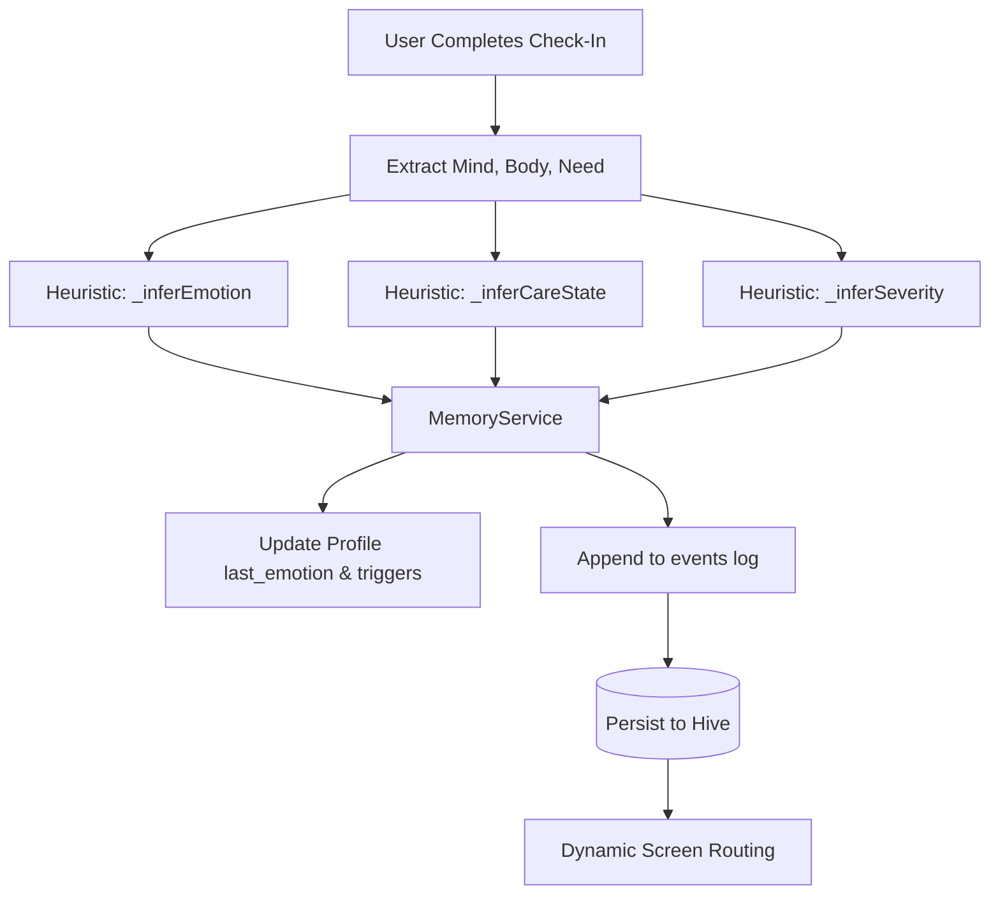

# Emotional Check-in System

The Emotional Check-in System is the primary way PsyFi captures explicit, self-reported user states. This acts as a foundation for the emotionally adaptive routing across the rest of the application.

## Implementation Overview

- **Screen:** `lib/home/screens/daily_checkin_screen.dart`
- **Data Model:** `_DailyCheckInResult`
- **Storage:** Hive via `MemoryService.saveContextualCheckIn()`

## Flow

## Collection and Heuristics

The check-in collects four primary data points:
1. **Mind Space:** What is occupying their thoughts (e.g., burnout, loneliness, overthinking).
2. **Body States:** Multiple selection of physical feelings (e.g., tense, disconnected, heavy).
3. **Needed Most:** What they seek (e.g., quiet, connection, rest).
4. **Energy Level:** A slider value.

### Heuristic Inference Logic
Instead of relying on the AI backend for check-ins (which would introduce latency and privacy concerns), the application uses immediate deterministic logic to categorize the check-in:

- **Emotion Inference (`_inferEmotion`):**
  - "loneliness" -> `lonely`
  - "burnout" or "heavy" -> `low`
  - "overthinking" or "tense" -> `anxious`
  - "overstimulated" -> `overwhelmed`
- **Care State Inference (`_inferCareState`):**
  - Needs "rest" -> `burnout`
  - Body is "overstimulated" -> `overwhelmed`
  - Emotion is "lonely" -> `isolated`
- **Severity Inference (`_inferSeverity`):**
  - Extreme energy levels or "overstimulated" -> `high` severity.
  - "tense" or "heavy" -> `medium`.

## Downstream Effects

Once the data is saved via `MemoryService`:
1. It updates the `last_emotion` in the user's profile.
2. The user's `support_preferences` are updated (e.g., if they selected "connection" as a need, their `social_preference` becomes "gentle_reconnection").
3. A `CareStateSnapshot` is recalculated.
4. **Routing:** If the calculated state is `overwhelmed` or `highRisk`, the user is intercepted with an "Overwhelmed Sheet" offering immediate grounding exercises instead of routing them to the standard homepage. Otherwise, they proceed to the emotionally adaptive dashboard.
