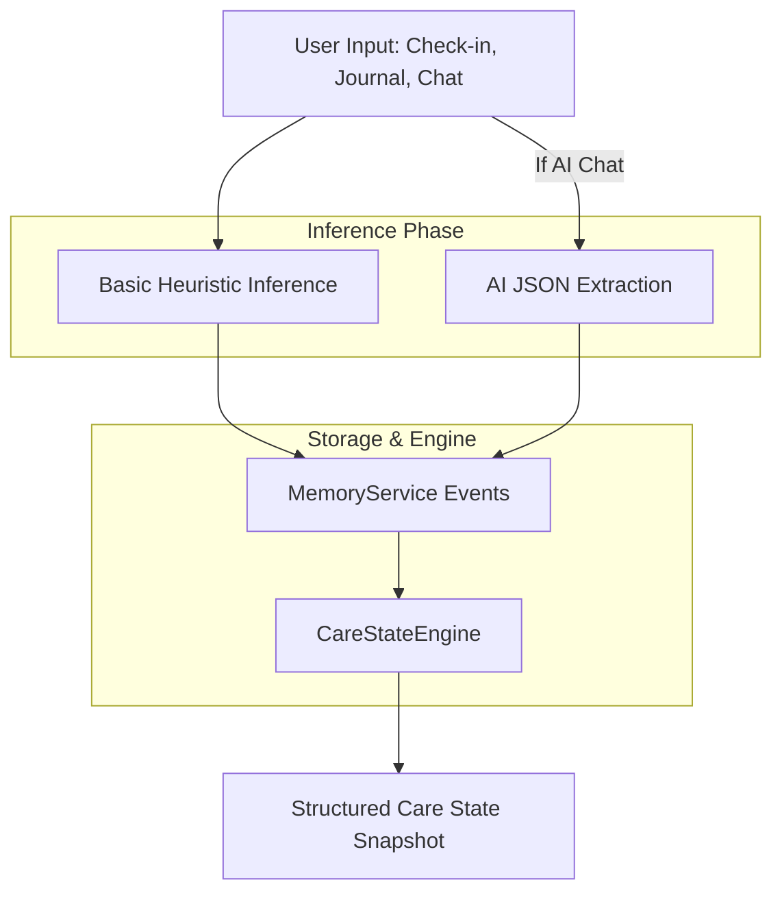

# Emotional Intelligence System

The Emotional Intelligence System in PsyFi is responsible for processing user inputs, inferring emotional states, calculating severity, and updating the application's overarching `CareState`. It operates entirely locally using deterministic logic combined with localized AI inference.

## Pipeline Overview

## Inference Mechanisms

The system derives emotional intelligence through two paths:

1. **Explicit / Heuristic Inference:** Handled locally within `MemoryService`. Basic string matching is used on journal entries and simple check-ins to derive a basic emotion (`_inferEmotion`), severity (`_inferSeverity`), and trigger (`_inferTrigger`).
2. **AI Inference:** When using the AI Chat, the `mistral-api` backend responds not just with conversational text, but with structured JSON insights containing the perceived `emotion`, `severity`, `trigger`, and `core_issue`.

## Care State Engine Logic

The core of the system is the `CareStateEngine` (`lib/core/adaptive/care_state_engine.dart`). 
It evaluates the past 10 days of events, current user profile, intervention history, and trigger patterns.

### The Care State Model

The engine assigns the user into one of seven mutually exclusive states:
- `stable`
- `anxious`
- `lowMood`
- `overwhelmed`
- `isolated`
- `burnout`
- `highRisk`

### Calculation Flow

1. **Base Scoring:** The engine maintains a scoreboard for all seven states.
2. **Recent Events Processing:** It iterates over the recent `events` array.
   - Anxiety-related keywords boost `anxious`.
   - Social trigger words (e.g., "lonely", "friends") boost `isolated`.
   - Work/study trigger words boost `burnout`.
   - High-risk language (e.g., "hurt myself") drastically boosts `highRisk` (+80 points).
3. **Streak & Severity Detection:**
   - Multiple high-severity events heavily boost `overwhelmed` and `highRisk`.
   - Consecutive negative emotional days boost `lowMood`.
4. **Behavioral Adjustments:**
   - Frequent grounding exercises (+3) boost `anxious`.
   - Skipped interventions boost `overwhelmed`.
   - Completed interventions heavily boost `stable` and reduce negative scores.
5. **Resolution:** The state with the highest score wins. If `highRisk` crosses a threshold (35), it overrides all other states regardless of rank.

### Output and Consumers

The engine outputs a `CareStateSnapshot` containing:
- The dominant `CareState`
- A confidence level
- A calculated risk score (1-100)
- The raw scoreboard
- Detected signal flags (e.g., `negative emotional streak`, `recurring triggers`)

| Input | Processing Component | Output | Storage | Used By |
| --- | --- | --- | --- | --- |
| Raw Text / UI selection | `MemoryService` / Mistral AI | Extracted Emotion, Trigger, Severity | Hive `events` | `CareStateEngine` |
| Past 10 Days Events | `CareStateEngine` | Scoreboard & CareState | Hive `care_state_history` | UI Theming, Suggestion Engine |
| Completed Activities | `MemoryService` | Intervention History | Hive `intervention_history` | `CareStateEngine` (Stability Boost) |

## Limitations and Gaps
- The basic heuristic inference (`_inferEmotion` etc.) uses simple substring matching and is relatively crude compared to the AI extraction.
- The system is highly reactive to the last few days; older events naturally drop out of the rolling evaluation window.
