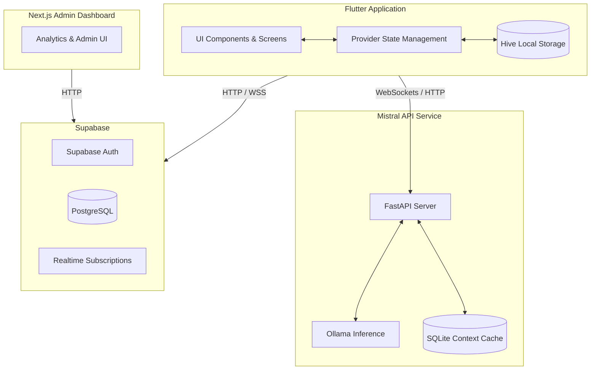

# Project Overview

## Purpose
PsyFi is a privacy-focused emotional wellness companion application designed to support reflection, emotional awareness, journaling, grounding, and personalized self-care. Rather than offering generic wellness interactions, PsyFi is built to be emotionally adaptive, creating a reflective space that understands patterns over time without compromising user privacy. It integrates journaling, grounding exercises, an AI chat companion, and memory diaries.

## Technology Stack
The PsyFi project is composed of three primary modules operating across a modern tech stack:

1. **Client Application (Mobile)**
   - **Framework:** Flutter 3.x / Dart 3.x
   - **State Management:** Provider
   - **Navigation:** GoRouter
   - **Local Storage:** Hive
   - **Real-time & Backend Services:** Supabase (Auth, Database, Realtime)
   - **AI Communication:** WebSockets to local backend

2. **AI Backend Service (`mistral-api`)**
   - **Framework:** FastAPI (Python)
   - **AI Inference Engine:** Ollama running locally (Mistral model)
   - **Local Database:** SQLite (for contextual caching and memory)
   - **Protocols:** HTTP (REST) and WebSockets

3. **Admin Dashboard (`psyfi-admin-dashboard`)**
   - **Framework:** Next.js (React)
   - **Styling:** TailwindCSS
   - **Data Visualisation:** Recharts / D3
   - **Integration:** Supabase (for analytics and admin control)

## Major Architectural Components

The system architecture relies on a local-first, privacy-preserving model supplemented by cloud synchronization.

- **UI & State Layer:** The Flutter app uses `Provider` to track the user's emotional "care state", navigating them to appropriate grounding exercises, journaling prompts, or community features via `GoRouter`.
- **Emotional Intelligence Engine:** A localized pipeline that collects emotional check-ins and contextual triggers, deciding which interventions (e.g., breathing, grounding) to present.
- **Local Persistence (Hive):** Stores sensitive data such as profiles, raw journal entries, patterns, and event memory locally on the device to minimize cloud dependency.
- **Contextual Memory & Diary Generation:** The backend (`mistral-api`) receives episodic memories and processes them into long-term structured reflections ("Memory Diary").
- **Real-time Chat & Community:** The app communicates with the Python backend via WebSockets for AI chat and connects to Supabase Realtime for professional support and community peer interactions.

## Entry Points

| Module | Entry Point | Responsibility |
| --- | --- | --- |
| **Flutter App** | `psy_fi/lib/main.dart` | Main execution of the mobile app, UI routing, state initialization, and local database hydration. |
| **Mistral API** | `mistral-api/app/main.py` | FastAPI application exposing endpoints for AI chat streaming, emotion inference, and diary generation. |
| **Admin Dashboard** | `psyfi-admin-dashboard/package.json` | The Next.js web application for administrative oversight and analytics visualization. |

## High-Level Architecture Diagram

