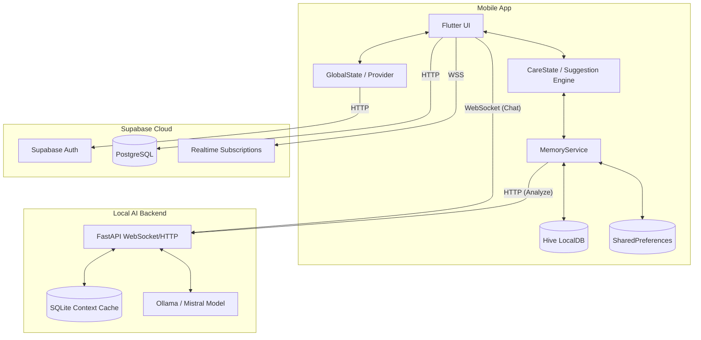

# System Architecture

The PsyFi system architecture is structured to prioritize local processing, privacy, and emotionally adaptive user experiences. It spans across three main environments: the local mobile device, the local AI backend (or a remotely hosted Python server for testing), and the cloud backend.

## Architectural Layers

### 1. Presentation/UI Layer (Flutter)
- Responsible for rendering the emotionally adaptive interface.
- Built using `StatefulWidget`s and `StatelessWidget`s.
- Navigates through `GoRouter` with auth-guard redirection.
- Dynamic theme elements change based on the current `CareState`.

### 2. State Management Layer
- **`Provider` / `GlobalState`:** Manages app-wide authentication status and core user identity (`userId`, `userRole`).
- **Local Screen State:** Handled natively by standard Flutter `State` objects for transient UI interactions (like typing a journal entry).

### 3. Business Logic & Adaptive Engine Layer
- **`CareStateEngine`:** A deterministic, rule-based engine that evaluates the user's emotional signals, recent events, intervention history, and trigger patterns to calculate a `CareStateSnapshot`.
- **`SuggestionEngine` & `PromotionEngine`:** Determine which interventions, breathing exercises, or contextual cards to show the user on the homepage based on their `CareState`.

### 4. Services Layer
- **`MemoryService`:** The central hub for local intelligence. It reads/writes to local storage, builds context for the AI, tracks emotional trends, and records intervention histories.
- **`AIService` / `AppConnectionManager`:** Handles network calls, WebSockets, and connectivity state.

### 5. Local Persistence Layer
- **`Hive`:** Used extensively for storing the user's emotional memory (`profile`, `events`, `diary`, `journal`, `care_state_history`). This ensures that sensitive emotional data remains on-device as much as possible.
- **`SharedPreferences`:** Used for simple key-value flags, such as tracking if the daily check-in has been completed.
- **`SQLite` (Backend):** Used by the `mistral-api` as a transient context cache.

### 6. Cloud Persistence & Realtime Layer
- **Supabase PostgreSQL:** Stores user roles, profiles, and community posts.
- **Supabase Auth:** Handles user registration, login, and secure session management.
- **Supabase Realtime:** Facilitates live messaging for professional support and community features.

### 7. AI & Inference Layer
- **`mistral-api` (FastAPI + Ollama):** Processes chat inputs, categorizes emotions/triggers, and summarizes long-term memory into daily diaries using local LLM inference.

## System Communication Flow

## System Boundaries

- **On-Device:** All `CareState` calculation, trigger counting, pattern identification, and emotional intelligence history stay on the device within `Hive`.
- **Cross-Boundary (AI):** When chatting with the AI or generating a diary, the `MemoryService` constructs a text-based context payload and sends it to the FastAPI service.
- **Cross-Boundary (Cloud):** Authentication tokens and public community/professional chat messages are sent to Supabase.
