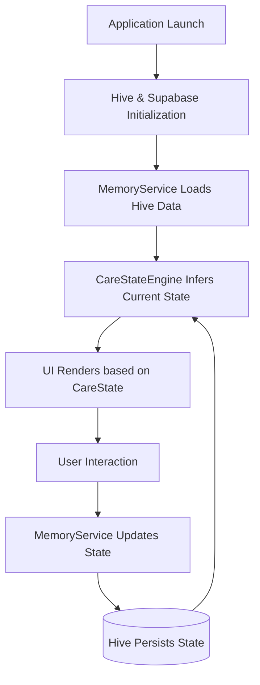

# User State Lifecycle

The user state in PsyFi is intentionally split between transient session state (authentication) and deeply persisted emotional memory (care state, context, history). The application uses local-first storage to protect privacy.

## Source of Truth

- **Identity & Auth:** Supabase Auth + `GlobalState` (in memory).
- **Emotional Intelligence & Context:** `MemoryService` using Hive local storage.

## Persistent State Models

The primary persistent state is maintained inside a single Hive box named `memory`, under the key `data`. It is a structured JSON-like Map containing:

1. **`profile`**: User preferences, coping styles, last emotion, and core issues.
2. **`events`**: An episodic memory log of every major interaction (check-ins, chat messages, journal entries). Kept to a rolling window (e.g., max 180 events).
3. **`patterns`**: A frequency map of emotional triggers.
4. **`diary` / `daily`**: Long-term structured reflections generated daily by the AI.
5. **`journal`**: Raw user journal entries.
6. **`care_state_history`**: Snapshots of the `CareStateEngine`'s output over time.
7. **`intervention_history`**: Logs of behavioral interventions shown, completed, or skipped.
8. **`support_preferences`**: Dynamic preferences adapting to what the user finds helpful.

## State Lifecycle Flow

## Lifecycle Triggers

### 1. Application Launch
On launch, `main.dart` initializes `Hive` and opens the `memory` box. `MemoryService.getMemory()` guarantees that all state collections exist, hydrating them with defaults if missing.

### 2. Emotional Check-in
When a user completes an emotional check-in (e.g., indicating "anxious"):
- **Relevant File:** `lib/core/components/memory_service.dart` (`saveEmotionCheckIn` or `saveContextualCheckIn`).
- **Flow:**
  1. Updates `profile["last_emotion"]`.
  2. Creates an `event` record indicating the emotion, source, and severity.
  3. Appends to `events` list.
  4. Triggers `_appendCareStateSnapshot()` which runs the `CareStateEngine`.
  5. Saves the updated map to Hive.
  6. The `CareState` changes, potentially altering the UI tone and suggested interventions.

### 3. AI Conversation
When the user sends a message to the AI:
- **Relevant File:** `lib/core/components/memory_service.dart` (`updateMemory`).
- **Flow:**
  1. The AI backend responds with the chat message *and* inferred JSON insights (emotion, severity, trigger).
  2. The app receives this JSON.
  3. Updates `patterns` (incrementing trigger counts).
  4. Appends a new `event` for the user's message.
  5. Adds new `tags` or `core_issues` to the `profile`.
  6. Runs `CareStateEngine` and persists to Hive.

### 4. Intervention Completion
When the user interacts with a behavioral intervention (e.g., finishes a breathing exercise):
- **Relevant File:** `lib/core/components/memory_service.dart` (`recordInterventionEvent`).
- **Flow:**
  1. A record is added to `intervention_history` noting if it was "completed" or "skipped", and its "effectiveness_score".
  2. Updates `support_preferences` based on what was helpful.
  3. Saves to Hive.

## Important Notes
- **Application Restarts:** Because all emotional state is saved in Hive, it survives application restarts seamlessly.
- **Remote Synchronization:** Currently, the emotional memory state is entirely local and does not sync to Supabase. Supabase only stores authentication status and relational data for community/professional features.
